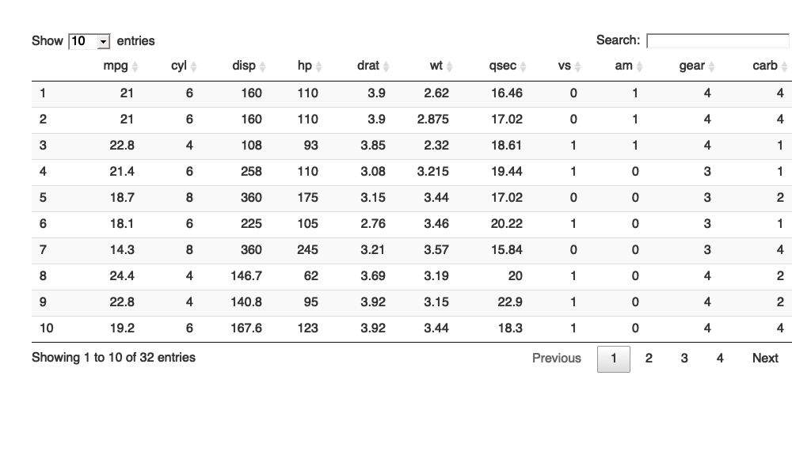

<!-- README.md is generated from README.Rmd. Please edit that file -->

```{r setup, include = FALSE}
knitr::opts_chunk$set(
  collapse = TRUE,
  comment = "#>",
  fig.path = "man/figures/README-",
  out.width = "100%"
)
```

```{r data, include = FALSE}
DT::datatable(tibble::tibble(Site = "NWT", Tidy = "check"))
```

<!-- pkgdown:example -->


In that case, don't forget to commit and push the resulting figure files, so they display on GitHub and CRAN.
